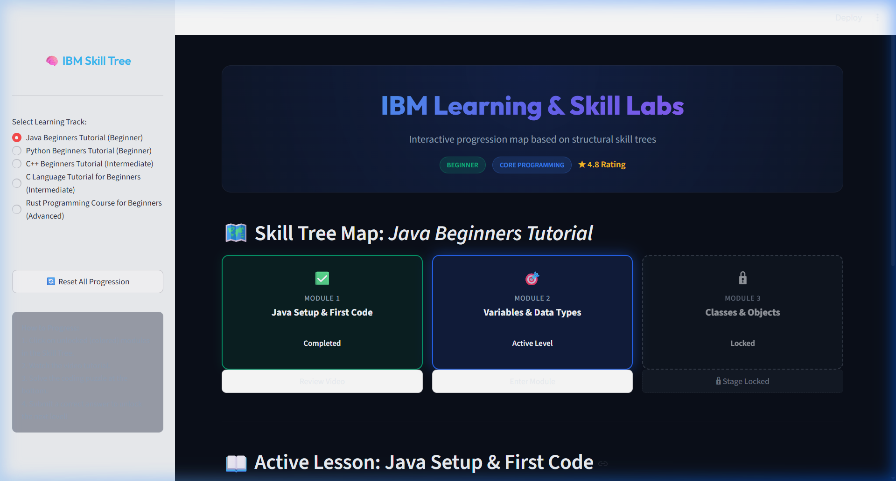
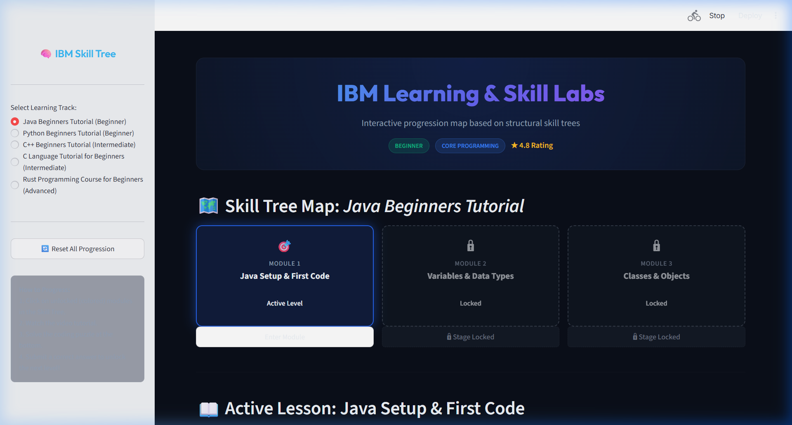
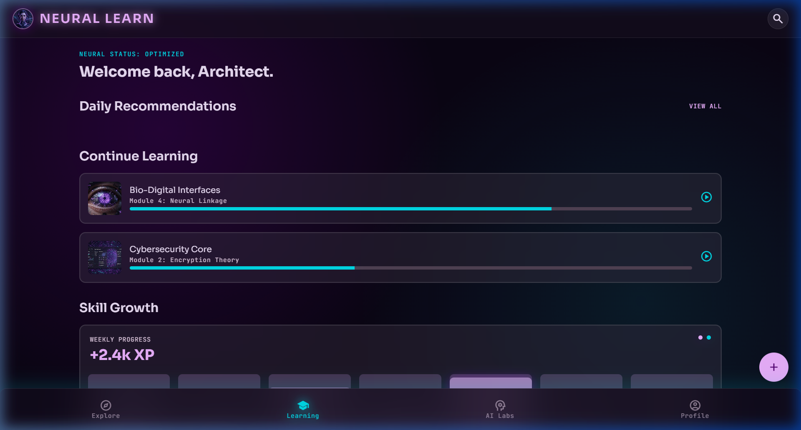
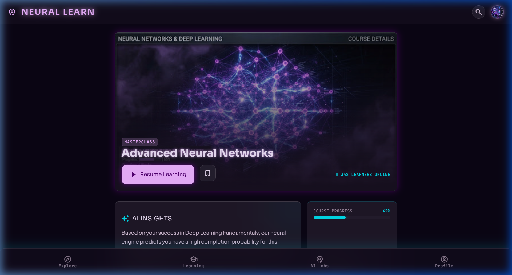
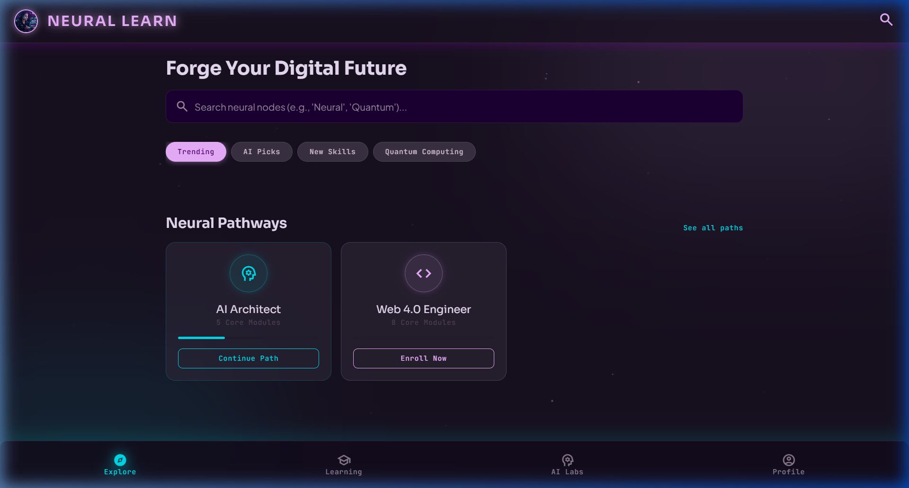
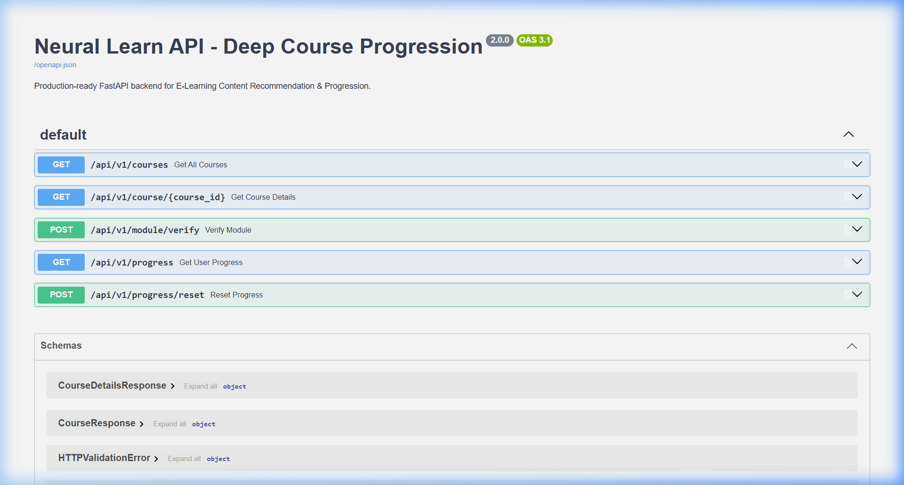
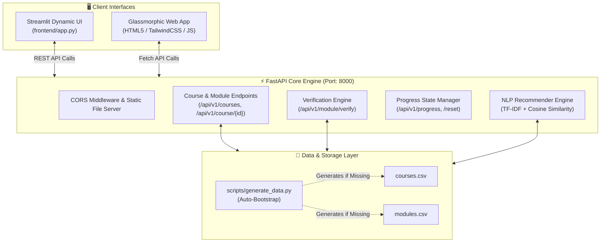

# 🧠 Neural Learn — Deep Course Progression & Skill Tree Lab
### *IBM Project-Based Experiential Learning (PBEL 3.0)*

[](https://fastapi.tiangolo.com)
[](https://streamlit.io)
[](https://www.python.org/)
[](https://scikit-learn.org/)
[](https://tailwindcss.com/)
[](https://opensource.org/licenses/MIT)

---

## 📌 Overview

**Neural Learn (PBEL 3.0)** is an intelligent, gamified e-learning progression and recommendation platform designed to transform traditional online learning into an interactive, milestone-driven journey. Built with a high-performance **FastAPI** backend and an **IBM Carbon / Cyber-styled Streamlit & Web frontend**, Neural Learn dynamically regulates curriculum progression via visual **Skill Tree Maps**, enforces mastery through **Live Syntax Repair Puzzles**, and provides **Content-Based AI Recommendations** powered by TF-IDF vectorization and Cosine Similarity.

---

## 📸 Visual Tour & Application Walkthrough

### 1️⃣ Interactive Skill Tree Progression Map
> **Use Case:** Visualizes the student's learning journey as a milestone-based linear skill tree. Modules are sequentially unlocked — students must solve the prerequisite coding puzzle before progressing to subsequent stages.



- **Dynamic Statuses:**
  - ✅ **Completed:** Modules previously mastered (e.g., *Module 1: Java Setup & First Code*).
  - 🎯 **Active Level:** The current stage unlocked for study and puzzle submission (e.g., *Module 2: Variables & Data Types*).
  - 🔒 **Stage Locked:** Future modules strictly disabled until prerequisites are fulfilled.

---

### 2️⃣ Synchronized Video Player & Live Coding Sandbox
> **Use Case:** Provides an integrated dual-pane learning environment where students watch curated video lessons and immediately practice live syntax repair in the browser.



- **Video Synchronization:** Timestamp-aware embedded YouTube player delivering bite-sized concepts.
- **Coding Sandbox:** Live syntax input box with intelligent string normalization (ignoring whitespace and quotation variations).
- **Guided Learning:** Expandable hint drawers assisting students without giving away full solutions.

---

### 3️⃣ Glassmorphic AI Learning Dashboard
> **Use Case:** Centralized hub tracking user engagement streaks, experience levels, and personalized course suggestions.



- **Streak & Level Indicators:** Gamified metrics motivating daily continuous learning.
- **Daily Recommendations:** AI-curated course cards with duration badges, category tags, and one-click enrollment.

---

### 4️⃣ AI Match Score & Course Deep-Dive
> **Use Case:** Delivers deep insights into curriculum structure and AI-predicted completion probability based on the student's profile.



- **AI Match Prediction:** Quantitative match rating calculated via TF-IDF textual similarity.
- **Neural Engine Insights:** Natural language analysis highlighting key learning objectives and bridge concepts.

---

### 5️⃣ Intelligent Course Discovery & Search
> **Use Case:** Allows students to explore diverse learning pathways through real-time query matching and category filtering.



- **Fast Exploration:** Instant search across programming tracks and domains.
- **Categorical Filtering:** Quick-switch badges for Systems Programming, Core CS, and Core Programming.

---

### 6️⃣ Interactive Swagger API Documentation
> **Use Case:** Fully documented OpenAPI/Swagger interface allowing developers to test endpoints, inspect schemas, and integrate third-party clients.



---

## ✨ Key Features

- 🗺️ **Interactive Gamified Skill Tree Map**
  - Linear, sequence-locked milestone progression for all learning tracks.
  - Dynamic visual state indicators: **Locked** (🔒), **Active Level** (🎯), and **Completed** (✅).
  - Defensive server-side enforcement preventing students from jumping ahead before mastering prerequisites.

- 👾 **Live Syntax Repair & Coding Sandbox**
  - Integrated interactive coding puzzles for every module.
  - Intelligent string normalization engine (resilient against spacing, quotation styles, and semicolons).
  - Instant validation feedback with celebratory visual effects (balloons & sound cues).
  - On-demand hint expanders for guided self-learning.

- 📺 **Synchronized Video Learning Hub**
  - Embedded YouTube video lectures with automated timestamp handling and fluid playlist fallbacks.
  - Side-by-side dual-pane layout: watch lectures on the left while solving syntax challenges on the right.

- 🤖 **Content-Based AI Recommendation Engine**
  - Natural Language Processing (NLP) pipeline utilizing **TF-IDF Vectorization** and **Cosine Similarity**.
  - Analyzes course textual profiles (titles, descriptions, categories) to recommend relevant follow-up courses.
  - Cold-start mitigation through popularity and rating fallback heuristics.

- 🎨 **Dual Modern User Interfaces**
  - **Streamlit App**: Dark cyber aesthetic with IBM Carbon inspiration, neon accents, responsive layout, and real-time state synchronization.
  - **Static Web Dashboard**: TailwindCSS glassmorphism dark-mode UI with smooth micro-interactions, scroll reveals, particle effects, and dynamic search discovery.

- 🛡️ **Production-Ready & Self-Healing**
  - Fully typed Pydantic V2 validation schemas.
  - Automatic database self-healing (auto-generates missing CSV data files upon startup).
  - Environmental sanity auditor (`verify_env.py`) and automated unit test suite (`tests/test_api.py`).

---

## 🏗️ System Architecture



---

## 📚 Curriculum & Learning Tracks

Neural Learn comes pre-configured with 5 comprehensive programming tracks spanning beginner to advanced levels:

| # | Track Title | Category | Difficulty | Rating | Key Concepts & Puzzles |
|---|-------------|----------|------------|:------:|------------------------|
| **1** | **Java Beginners Tutorial** | Core Programming | `Beginner` | ⭐ 4.8 | `main()` syntax, integer declarations, OOP object instantiation |
| **2** | **Python Beginners Tutorial** | Core Programming | `Beginner` | ⭐ 4.9 | `print()` statements, list initialization, `for` loop iterations |
| **3** | **C++ Beginners Tutorial** | Core Programming | `Intermediate` | ⭐ 4.7 | `#include <iostream>`, pointer declarations (`int*`), class definitions |
| **4** | **C Language Tutorial** | Core CS | `Intermediate` | ⭐ 4.6 | `return 0;`, `if` conditionals, dynamic memory allocation (`malloc`) |
| **5** | **Rust Programming Course** | Systems Programming | `Advanced` | ⭐ 4.5 | `cargo new`, variable mutability (`let mut`), ownership & borrowing (`&s`) |

---

## 🛠️ Tech Stack & Libraries

| Domain | Technology / Library | Purpose |
|---|---|---|
| **Backend Framework** | [FastAPI](https://fastapi.tiangolo.com/) | Asynchronous, high-performance RESTful API |
| **ASGI Server** | [Uvicorn](https://www.uvicorn.org/) | Lightning-fast ASGI web server |
| **Data Validation** | [Pydantic V2](https://docs.pydantic.dev/) | Strict data schemas and request/response serialization |
| **Data Processing** | [Pandas](https://pandas.pydata.org/) | CSV data manipulation and indexing |
| **Machine Learning / NLP** | [Scikit-Learn](https://scikit-learn.org/) | TF-IDF text vectorization and cosine similarity matching |
| **Interactive Frontend** | [Streamlit](https://streamlit.io/) | Reactive web dashboard with custom CSS and components |
| **Web Dashboard** | HTML5, JavaScript, [TailwindCSS](https://tailwindcss.com/) | Glassmorphic UI with animated particle canvas & Google Fonts |
| **Testing** | `unittest`, `requests` | End-to-end API integration and defensive logic tests |

---

## 📁 Directory Structure

```plaintext
SANSKAR_AI_PBEL_3.0/
├── assets/                  # High-resolution screenshots and UI demonstration media
│   ├── course_details_ai.png
│   ├── course_discovery.png
│   ├── dashboard_overview.png
│   ├── interactive_lesson.png
│   ├── skill_tree_map.png
│   └── swagger_api_docs.png
├── app/
│   ├── __init__.py
│   ├── main.py              # FastAPI application, route handlers & static file mounting
│   ├── recommender.py       # TF-IDF & Cosine Similarity content recommendation engine
│   └── schemas.py           # Pydantic schemas for courses, modules, and verification
├── data/
│   ├── courses.csv          # Relational catalog of courses, metadata & ratings
│   └── modules.csv          # Sequential module records, YouTube URLs & puzzle data
├── frontend/
│   ├── app.py               # Streamlit application (Skill Tree map & coding sandbox)
│   ├── index.html           # TailwindCSS Dashboard landing page
│   ├── explore.html         # Course discovery & search interface
│   ├── details.html         # In-depth track details with AI match predictions
│   └── profile.html         # Student progress & achievement profile
├── scripts/
│   ├── __init__.py
│   └── generate_data.py     # Automated dataset generator & bootstrap script
├── tests/
│   └── test_api.py          # Comprehensive automated test suite
├── requirements.txt         # Project Python dependencies
├── verify_env.py            # Pre-flight environment sanity auditor
└── README.md                # Project documentation
```

---

## 🚀 Quick Start Guide

Follow these steps to set up and run Neural Learn locally:

### 1️⃣ Clone the Repository
```bash
git clone https://github.com/sanskarrawat-nn/SANSKAR_AI_PBEL_3.0.git
cd SANSKAR_AI_PBEL_3.0
```

### 2️⃣ Create & Activate Virtual Environment
- **Windows (PowerShell):**
  ```powershell
  python -m venv venv
  .\venv\Scripts\Activate.ps1
  ```
- **macOS / Linux:**
  ```bash
  python3 -m venv venv
  source venv/bin/activate
  ```

### 3️⃣ Install Dependencies
```bash
pip install -r requirements.txt
```

### 4️⃣ Verify Environment & Database
Run the built-in environment auditor. It automatically validates installed packages and generates the dataset CSVs if they are not already present:
```bash
python verify_env.py
```
> **Output:** `SUCCESS: Environment is fully qualified and ready for launch!`

---

## 🖥️ Running the Application

### Option A: Launch the FastAPI Backend
Start the FastAPI server on `http://127.0.0.1:8000`:
```bash
uvicorn app.main:app --reload --port 8000
```
- **Interactive Swagger UI:** [http://127.0.0.1:8000/docs](http://127.0.0.1:8000/docs)
- **ReDoc Documentation:** [http://127.0.0.1:8000/redoc](http://127.0.0.1:8000/redoc)
- **Glassmorphic Web Dashboard:** [http://127.0.0.1:8000/](http://127.0.0.1:8000/)

### Option B: Launch the Streamlit Skill Tree Dashboard
Open a new terminal tab (with virtual environment active) and run:
```bash
streamlit run frontend/app.py
```
- **Streamlit Local URL:** [http://localhost:8501](http://localhost:8501)

---

## 📡 REST API Reference

| Method | Endpoint | Description |
|:---:|---|---|
| `GET` | `/api/v1/courses` | Retrieve list of all available learning tracks |
| `GET` | `/api/v1/course/{course_id}` | Retrieve course details with sequentially ordered modules and dynamic lock states (`is_locked`) |
| `POST` | `/api/v1/module/verify` | Submit code solution for syntax verification; unlocks the next level upon correct submission |
| `GET` | `/api/v1/progress` | Get dictionary map of student's current unlocked level for each course |
| `POST` | `/api/v1/progress/reset` | Reset student's progress across all courses back to Level 1 |

### Example: Verify Code Solution

**Request:**
```http
POST /api/v1/module/verify HTTP/1.1
Host: 127.0.0.1:8000
Content-Type: application/json

{
  "course_id": "1",
  "module_id": "1_1",
  "user_answer": "System.out.print('Hello');"
}
```

**Response (`200 OK`):**
```json
{
  "success": true,
  "message": "🎉 Correct! Your syntax mapping matches the requirements.",
  "unlocked_next": true
}
```

---

## 🧪 Automated Testing

Neural Learn includes an automated test suite verifying course data serialization, lock state resolution, string normalization defense, and anti-cheating 403 barriers.

1. Ensure the FastAPI backend is running:
   ```bash
   uvicorn app.main:app --port 8000
   ```
2. Execute the test suite in a separate terminal:
   ```bash
   python -m unittest tests/test_api.py
   ```

```plaintext
----------------------------------------------------------------------
[PASS] Course details retrieval and lock state validation.
[PASS] Module verification with normalization.
[PASS] Module verification with incorrect answer.
[PASS] Defensive checking for locked module submission.
Ran 4 tests in 0.082s

OK
```

---

## 🎮 How the Progression Engine Works

1. **Sequential Module Unlocking**:
   Each course starts with only **Module 1** unlocked. Modules 2 and above remain locked until the student passes the prerequisite syntax puzzle.
2. **Defensive Normalization**:
   The verification engine cleans whitespace, lowers case where appropriate, and harmonizes single/double quotes so students are evaluated on syntax logic rather than trivial spacing quirks.
3. **Anti-Skipping Enforcement**:
   Submitting solutions for locked modules directly triggers a `403 Forbidden` error, protecting against URL tampering or out-of-order execution.
4. **State Reset**:
   Students can reset their progression anytime to re-attempt tracks from scratch using the sidebar reset tool.

---

## 🤝 Contributing

Contributions, issues, and feature requests are welcome!
1. Fork the Project
2. Create your Feature Branch (`git checkout -b feature/AmazingFeature`)
3. Commit your Changes (`git commit -m 'Add some AmazingFeature'`)
4. Push to the Branch (`git push origin feature/AmazingFeature`)
5. Open a Pull Request

---

## 📜 License

Distributed under the **MIT License**. See `LICENSE` for more information.

---

## 👤 Author

**Sanskar Rawat**  
- GitHub: [@sanskarrawat-nn](https://github.com/sanskarrawat-nn)
- Project: **IBM PBEL 3.0 — Neural Learn**
